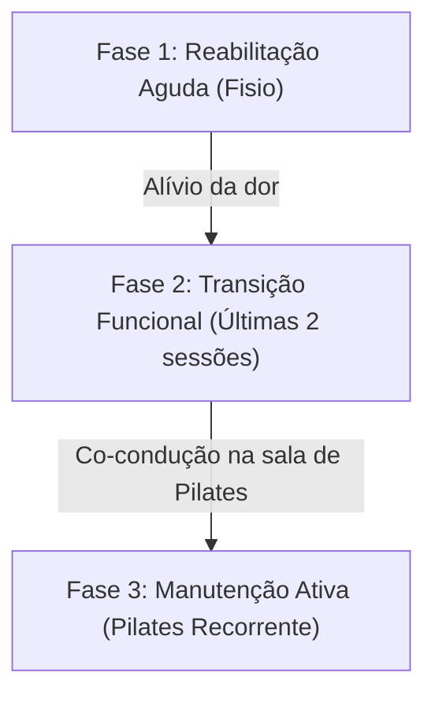

# Parecer de Consultoria Estratégica: Clínica Kinesis
## O Desafio: Conciliar a Ética Clínica com a Eficiência Financeira

---

## 🔍 1. Desconstruindo o Dilema Conceitual: Sessão Avulsa vs. Plano Clínico de Reabilitação

Muitos clínicos de excelência sentem um bloqueio moral ao oferecer "pacotes de sessões", pois o termo remete a uma transação comercial mercantilista (estilo "leve 10, pague 9"). Na Clínica Kinesis, isso fez com que adotassem o modelo pós-pago (cobrança no final do mês baseado em sessões atendidas). 

No entanto, do ponto de vista da **medicina baseada em evidências** e da gestão clínica moderna, o modelo de cobrar "sessão por sessão" é conceitualmente frágil por dois motivos:

1. **Autonomização Precoce e Incorreta do Paciente:** Ao cobrar por sessão avulsa, a clínica implicitamente transfere ao paciente a decisão de continuar ou não o tratamento. O paciente com dor lombar aguda melhora após 4 ou 5 sessões, sente-se "curado" e abandona o tratamento antes da fase de recondicionamento motor e muscular. O resultado é a **recidiva da lesão** e um baixo LTV (tempo de permanência).
2. **Desconexão com a Ciência do Tecido Humano:** A reabilitação de tecidos (tendões, ligamentos, cartilagens) segue ciclos biológicos previsíveis (6, 8, 12 semanas). Um fisioterapeuta não deve vender "horas de serviço", mas sim prescrever um **plano terapêutico científico** com início, meio e fim.

### 💡 A Solução Conceitual (Recomendação G4 Skills - Item 9):
> [!IMPORTANT]
> **Substituir "Pacotes Comerciais" por "Planos de Tratamento Estruturados"**
> 
> Durante a avaliação inicial, o profissional não deve sugerir "fazer algumas sessões e ver como fica". Ele deve prescrever um **Protocolo Clínico Recomendado** com base nas diretrizes clínicas para aquela patologia específica.
> 
> * **Exemplo de Prescrição:** *"Para o seu caso de tendinopatia do ombro, a literatura médica indica um protocolo de reabilitação de 10 semanas (20 sessões). As primeiras 6 semanas serão de controle de dor e ativação neuromuscular; as 4 semanas seguintes serão de transição funcional e fortalecimento no Pilates."*
> 
> O paciente não está comprando um "pacote de descontos", ele está contratando a execução de um **protocolo de reabilitação prescrito**.

---

## 📊 2. A Matemática Financeira do Absenteísmo (As Faltas de 20%)

A cobrança pós-paga via Pix manual no final do mês gera o pior dos mundos: a clínica assume 100% do risco operacional. Se o paciente falta de última hora, o fisioterapeuta fica ocioso (recebendo comissão ou de braços cruzados), a sala fica indisponível para outros pacientes e o caixa é penalizado. 

Como a cobrança é posterior, a secretária e o profissional sentem um imenso constrangimento social de cobrar por uma sessão que o paciente "não realizou", mesmo havendo a regra de aviso de 24h. Na prática, a clínica não cobra e absorve o prejuízo.

### O Impacto Financeiro Oculto (Mês Base: Maio/2026)
Utilizando os dados reais de faturamento da Fisioterapia contidos no banco de dados da clínica, simulamos o impacto da taxa de faltas de 20% no faturamento mensal:

* **Sessões Clínicas Realizadas (Fisio):** 588 sessões
* **Faturamento Bruto Realizado (Fisio):** R$ 92.965,28
* **Ticket Médio por Sessão (Fisio):** R$ 158,10
* **Sessões Perdidas por Faltas (20% do agendado total):** 147 sessões
* **Prejuízo Mensal Direto (Ociosidade e Não-Cobrança):** **R$ 23.240,70**
* **Prejuízo Anualizado Estimado:** **R$ 278.888,40**

> [!WARNING]
> **Custo de Oportunidade e Alavancagem Operacional**
> 
> A perda de R$ 23,2 mil mensais na fisioterapia não é apenas "faturamento que deixou de entrar", mas sim **capacidade produtiva desperdiçada** que a clínica pagou para manter aberta (aluguel, recepção, energia). Recuperar essa perda operacional através da mudança do modelo de cobrança equivale a aumentar o faturamento em **25,0%** sem precisar investir um único real em captação de novos clientes ou marketing.

---

## 💎 3. O Modelo de Assinatura por Vaga Reservada ("Slot Lease")

Para solucionar as faltas e a inadimplência sem soar comercial, a Clínica Kinesis deve migrar para o modelo de **Mensalidade por Vaga Reservada ("Slot Lease")**, que é amplamente adotado em clínicas premium internacionais e escolas de alto padrão.

### Como Funciona:
1. O paciente, ao aceitar o **Plano de Tratamento Clínico**, reserva horários fixos e exclusivos na agenda da clínica (exemplo: terças e quintas-feiras, às 14:00, com o fisioterapeuta João).
2. O paciente paga um valor mensal fixo (recorrência) **no início do ciclo de 30 dias** (ou cadastrado no cartão de crédito via Asaas). Ele está pagando pelo *direito de uso exclusivo* daquele horário do profissional naquele mês.
3. A clínica assume o compromisso de ter o fisioterapeuta e a sala de reabilitação 100% dedicados a ele naquele período.

### A Justificativa Clínica e Ética do "Slot Lease":
* **Compromisso Terapêutico:** A constância dos atendimentos é crucial para a cicatrização tecidual e o sucesso da reabilitação. O pagamento antecipado do slot funciona como um "compromisso ativo" do paciente com a sua própria saúde.
* **Reserva de Capacidade:** O tempo do fisioterapeuta é um recurso escasso e perecível. Se o paciente não comparece, aquela hora expira e não pode ser vendida retroativamente. O custo da disponibilidade é fixo.

### Regra de Cancelamento e Reposição Justa:
* **Aviso prévio > 24 horas:** O paciente pode reagendar a sessão em um horário alternativo dentro do mesmo mês corrente, sujeito à disponibilidade de agenda da clínica.
* **Aviso prévio < 24 horas ou No-Show:** A sessão é considerada consumida (cobrada normalmente) e não há direito a reposição, pois o slot de tempo foi ocupado e o profissional ficou indisponível para outros pacientes.

---

## 🔄 4. Estratégia de Transição Clínica (Fisioterapia ➔ Pilates)

A taxa de conversão atual de **3,76%** (apenas 84 dos 2.232 pacientes da fisioterapia migraram para o Pilates) é um gargalo estratégico gigantesco. Hoje, o Pilates opera de forma isolada, quando deveria ser a fase final obrigatória da jornada de reabilitação.

Para resolver isso de forma natural e altamente clínica, propomos o **Protocolo de Alta Assistida**:

### Como Executar:
1. **Prescrição Integrada:** O Pilates de manutenção não deve ser vendido na recepção como uma "modalidade extra". Ele deve ser prescrito pelo fisioterapeuta no prontuário como: *"Fase de estabilização articular e prevenção de recidiva de dor via Pilates Clínico"*.
2. **O "Warm Handoff" (Passagem de Bastão Calorosa):** Nas últimas duas sessões do plano de tratamento de fisioterapia, os últimos 20 minutos de atendimento são realizados **dentro do estúdio de Pilates**.
   - O fisioterapeuta apresenta o paciente ao instrutor de Pilates.
   - O fisioterapeuta explica ao instrutor a lesão do paciente, as restrições mecânicas e quais exercícios foram bem-sucedidos na reabilitação.
   - A última sessão de fisioterapia é realizada em conjunto (co-conduzida pelo fisioterapeuta e pelo instrutor de Pilates).
3. **Conversão Psicológica:** Esse protocolo remove a fricção e o medo do paciente de iniciar uma atividade nova. O paciente sente que o Pilates é uma continuação segura do seu tratamento clínico sob o olhar de quem o curou.

---

## 📈 5. Alinhamento com as Recomendações do Diagnóstico G4 Skills

Cruzando o diagnóstico da consultoria **G4 Skills** com a nossa análise, consolidamos os seguintes direcionamentos estratégicos de maturidade corporativa:

| Área Avaliada | Pontuação | Recomendação G4 Skills | Ação Prática Proposta para a Kinesis |
| :--- | :---: | :--- | :--- |
| **Financeiro** | 25 / 100 | Reduzir processos manuais e estruturar previsibilidade. | Cadastrar os pacientes de Fisioterapia no Asaas para **Cobrança Recorrente** (Mensalidade/Slot) e habilitar cartão de crédito (eliminando a busca ativa e conferência manual de Pix). |
| **Modelo de Negócio** | 38 / 100 | Criar Planos de Tratamento Estruturados baseados em evidências. | Acabar com a venda de sessões avulsas pós-pagas. Implementar os **Protocolos Terapêuticos Prescritos (PTP)** na primeira consulta. |
| **Vendas** | 22 / 100 | Estruturar programas formais de continuidade de cuidados. | Implementar o **Protocolo de Alta Assistida** integrado (Fisio ➔ Pilates) com passagem de caso física entre profissionais. |
| **Gestão do Tempo** | - | Delegar o operacional e focar 4 a 8 horas na estratégia. | Integrar o **Kinesis App** com o WhatsApp e o Asaas para que faturas, confirmações de consulta e cobranças rodem de forma **100% automatizada**, liberando Leticia e Daniel para a gestão. |

---

## 📝 6. Termo de Compromisso Terapêutico (Exemplo de Abordagem Clínica)

Para formalizar o modelo de vaga reservada com elegância e tom clínico, a recepção deve apresentar um simples formulário impresso ou digital na primeira sessão:

> **Termo de Compromisso e Assiduidade Terapêutica Kinesis**
>
> *"Na Clínica Kinesis, trabalhamos com reabilitação baseada em resultados clínicos. O sucesso do seu tratamento depende diretamente da constância das sessões recomendadas pelo seu fisioterapeuta.*
> 
> *Para garantir a qualidade do seu atendimento, reservamos um profissional de forma exclusiva e uma sala com capacidade limitada para o seu horário (ex: Terças e Quintas às 14h).*
> 
> * **Sua vaga está garantida:** O valor do seu tratamento é faturado mensalmente no início do ciclo.
> * **Regra de Faltas:** Faltas comprometem a sua evolução e impedem que outros pacientes utilizem o horário. Caso precise reagendar, solicitamos aviso prévio de 24 horas. Remarcações com aviso de última hora (<24h) ou não comparecimento serão computadas normalmente como sessão realizada, uma vez que o profissional e a estrutura estiveram à sua disposição."*

---

## 🧭 7. Próximos Passos Recomendados para os Sócios

Para evoluir este modelo de negócio sem atritos operacionais, sugerimos os seguintes passos estratégicos:

1. **Apresentação aos Sócios:** Reunião com Stuart e Paula para apresentar os números reais de perda com faltas (R$ 23,2 mil/mês) e alinhar a transição conceitual de "sessão" para "protocolo".
2. **Configuração do Asaas para Fisioterapia:** Estender o contrato atual do Asaas (que já opera no Pilates) para criar cobranças recorrentes no cartão/Pix para a Fisioterapia.
3. **Piloto de Alta Assistida:** Escolher os próximos 5 pacientes de Fisioterapia que estão perto de receber alta e rodar o piloto de transição de 2 sessões conjuntas com o Pilates para validar a taxa de conversão.
