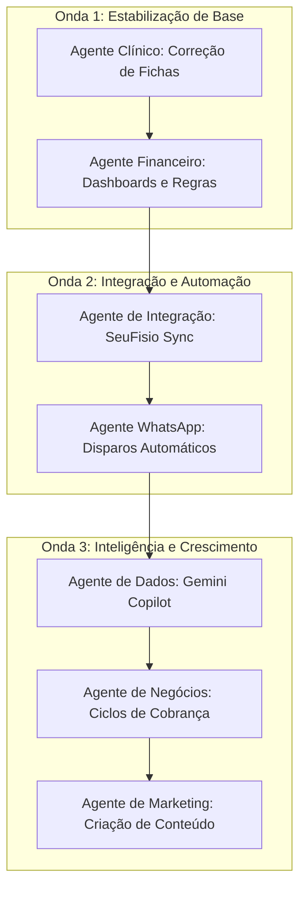

# 🛡️ O Esquadrão Multi-Agente Kinesis: Plano de Batalha

Daniel, você trouxe uma visão clara e ambiciosa. Administrar uma clínica em crescimento enquanto atende em tempo integral é uma jornada exaustiva, e o uso de agentes de IA especializados é o caminho ideal para acelerar essas soluções sem sobrecarregar sua rotina.

Abaixo, divido suas 8 batalhas em um **Esquadrão Multi-Agente Kinesis**. Cada agente terá um escopo restrito, ferramentas adequadas e metas claras.

---

## 👥 1. O Esquadrão de Agentes Kinesis

### 🧪 Agente 1: Especialista Clínico (`kinesis-clinical-agent`)
* **Batalha:** Atuação Clínica (Revisar erros de formulários e templates entre KinesisLab e Kinesis App).
* **Escopo:** Comparar o código e as regras de renderização dinâmica do prontuário, tabelas Prisma (`Assessment`, `AssessmentTemplate`) e páginas de avaliação entre o repositório atual e o original.
* **Meta:** Eliminar todas as incoerências de salvamento e renderização dos formulários de Ombro, Joelho, Lombar, etc.

### 🪙 Agente 2: Especialista Financeiro (`kinesis-finance-agent`)
* **Batalha:** Gestão Financeira (Cálculo de comissões, rateio de sócios 40/40/20 e 1/3, fluxo de caixa e custos).
* **Escopo:** Implementar a lógica de regras de repasse de profissionais e cálculo de lucro líquido no banco de dados com visualização idêntica à planilha do Excel.
* **Meta:** Substituir as planilhas manuais e erráticas por um dashboard financeiro automático e auditável dentro do Kinesis App.

### 🔌 Agente 3: Engenheiro de Integração (`kinesis-sync-agent`)
* **Batalha:** Importação de Dados do SeuFisio (Agenda fechada sem API aberta).
* **Escopo:** Desenvolver uma Extensão do Chrome ou um script local que extrai os dados de presença/faltas do SeuFisio web em 1 clique e alimenta o Kinesis App via API autenticada.
* **Meta:** Acabar com o upload manual de arquivos e alertar sobre ausências em tempo real.

### 💬 Agente 4: Especialista em Comunicação (`kinesis-whatsapp-agent`)
* **Batalha:** Interação Automatizada com Pacientes (WhatsApp API).
* **Escopo:** Configurar la integração com gateways de WhatsApp (ex: Evolution API ou Z-API) e criar o agendador automático (Cron) para disparar lembretes de diários de dor e vídeos de exercícios.
* **Meta:** Eliminar 100% dos disparos manuais, removendo a falha humana e mantendo a constância do tratamento.

### 📊 Agente 5: Copiloto de Inteligência de Dados (`kinesis-ai-copilot`)
* **Batalha:** Módulo de Estatística com IA (Análises críticas mensais).
* **Escopo:** Integrar a API do Gemini ao dashboard de estatísticas para responder perguntas em linguagem natural e sugerir correlações clínicas (ex: "Cruzamento de faltas com nível de dor").
* **Meta:** Entregar relatórios mensais automáticos de insights de gestão.

### 💼 Agente 6: Consultor de Negócios e Gestão (`kinesis-business-advisor`)
* **Batalha:** Novas Estratégias de Cobrança e Divisão de Tempo de Gestão.
* **Escopo:** 
  1. Desenvolver a engenharia financeira e a política de cancelamento dos **Planos de Tratamento por Ciclo Clínico** (Fisioterapia).
  2. Desenvolver o modelo de compensação financeira e governança com seus sócios (Daniel, Stuart, Paula) para permitir que você dedique 4 horas à gestão sem prejuízo financeiro.
* **Meta:** Garantir previsibilidade financeira à clínica e viabilidade financeira ao seu papel de gestor.

### 📣 Agente 7: Fábrica de Conteúdo & Marketing (`kinesis-marketing-team`)
* **Batalha:** Equipe de Redes Sociais por IA.
* **Escopo:** Estruturar um pipeline multi-agente que:
  1. *Pesquisador:* Busca temas de saúde em alta no Google/PubMed.
  2. *Redator:* Escreve posts e carrosséis com tom de voz Kinesis.
  3. *Designer:* Gera imagens ou Mockups no Antigravity.
  4. *Revisor:* Garante alinhamento ético e científico.
* **Meta:** Gerar presença digital orgânica consistente sem gastar seu tempo ou de agências externas.

---

## 🗺️ 2. Cronograma de Batalha (Roadmap Recomendado)

Proponho dividirmos a execução em **3 Ondas Estratégicas**, garantindo que as fundações fiquem prontas antes das automações complexas:

---

## ⚙️ 3. Como Iniciamos as Batalhas de Forma Rápida?

Como agente principal, posso coordenar e criar cada um desses especialistas para você. Para isso, podemos usar as seguintes estratégias de pair programming e comando:

1. **Recomendação de Comandos:**
   * `/goal`: Ative quando quiser que eu lidere uma tarefa longa (como programar todo o módulo financeiro baseado no Excel) de forma extra-completa e autônoma.
   * `/grill-me`: Ideal para a batalha **"Tempo para Gestão"** e **"Estratégia de Cobrança"**. Faremos uma entrevista dinâmica para desenhar o plano de metas societárias e o modelo de reabilitação fechada de acordo com sua realidade.

2. **Criação de Subagentes:**
   Já posso delegar a primeira tarefa crítica (Onda 1) para o **Agente Clínico** restaurar o funcionamento de todas as fichas de avaliação comparando com o KinesisLab antigo.
