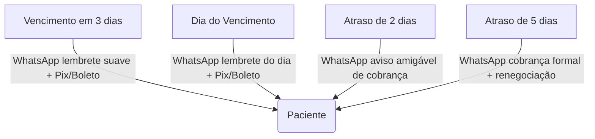

# Plano Estratégico: Otimização de Cobranças e Assinaturas (Kinesis)

Este documento apresenta estratégias de negócio e arquitetura técnica para modernizar e automatizar os fluxos de cobrança, assinaturas (recorrência) e conciliação financeira da Clínica Kinesis.

---

## 1. Modelos de Cobrança Sugeridos para a Kinesis

Para clínicas de reabilitação e pilates, a transição do modelo "pago por sessão" para modelos previsíveis traz maior previsibilidade de caixa (LTV) e reduz o abandono de tratamento.

### A. Modelo de Assinatura Recorrente (Clube Kinesis)
* **Como funciona:** O paciente contrata um plano recorrente mensal, trimestral ou anual (ex: Pilates 2x por semana ou Manutenção de Fisioterapia). O valor é debitado mensalmente de forma automática no cartão de crédito (sem consumir o limite total do cartão do cliente, estilo Netflix/SmartFit).
* **Vantagens:**
  * **Inadimplência Zero:** Cobrança automática elimina o esquecimento do paciente.
  * **Previsibilidade:** Saber exatamente o faturamento recorrente do próximo mês.
  * **Retenção:** Pacientes em planos recorrentes tendem a faltar menos e continuar o tratamento por mais tempo.

### B. Pacotes de Créditos (Sessões Pré-Pagas)
* **Como funciona:** O paciente compra um pacote de 10, 20 ou 30 sessões com um desconto progressivo. O sistema Kinesis App credita essas sessões na conta do paciente e, a cada atendimento lançado, desconta um crédito.
* **Vantagens:**
  * **Caixa Rápido:** Entrada imediata de dinheiro para a clínica.
  * **Compromisso:** O paciente já pagou, o que reduz faltas injustificadas.

---

## 2. Automações e Régua de Cobrança (WhatsApp)

A inadimplência e o atraso no pagamento de boletos/Pix manuais tomam muito tempo da secretaria. Sugerimos a implementação de uma **Régua de Cobrança Automática** via WhatsApp (usando o novo canal configurado):

* **Benefício:** Reduz o trabalho manual da secretária de cobrar o paciente de forma constrangedora. A automação assume a cobrança de forma institucional e impessoal.

---

## 3. Arquitetura de Integração de Gateway de Pagamento

Para viabilizar Pix Automático, Boletos com conciliação na hora e principalmente Assinaturas no Cartão de Crédito, é necessário conectar o Kinesis App a um Gateway de Pagamento. 

Sugerimos dois players líderes em mercado médico no Brasil:

### 1. ASAAS (Recomendado para o Brasil)
* **Foco:** Especialista em automação de cobranças recorrentes para PMEs e clínicas.
* **Custos aproximados:**
  * Pix Recebido: R$ 0,99 a R$ 1,99 por transação.
  * Boleto Compensado: R$ 1,99 a R$ 2,99.
  * Cartão de Crédito: ~2,99% + R$ 0,40 por transação.
* **Vantagens:** Possui régua de cobrança (SMS, e-mail, robô de voz) nativa da própria plataforma, além de uma API extremamente simples de integrar com o Next.js do Kinesis App.

### 2. Pagar.me / Stripe
* **Foco:** Alta performance em transações de cartão de crédito.
* **Vantagens:** Stripe possui o "Stripe Billing" que é o motor de assinaturas mais robusto do mundo.

---

## 4. Próximos Passos de Desenvolvimento para o Kinesis App

Caso decidamos seguir, os novos módulos no Kinesis App seriam divididos assim:

1. **Modelagem de Banco de Dados (`schema.prisma`):**
   * Criar tabela `Subscription` (plano contratado, status, data de vencimento, gatewayId).
   * Criar tabela `PatientWallet` (créditos disponíveis de sessões).
2. **Painel de Gestão de Assinaturas (UI):**
   * Tela na ficha do paciente para gerenciar seu plano ativo, emitir links manuais de pagamento e visualizar faturas pendentes.
3. **Módulo de Webhooks:**
   * Endpoint de API no Next.js (`/api/webhooks/payments`) para receber avisos do Asaas/Stripe quando o paciente pagar (marcando automaticamente a fatura como paga e liberando créditos de sessões).
