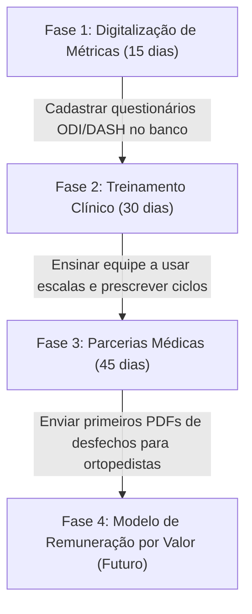

# Saúde Baseada em Valor (VBHC): Parecer Estratégico para a Clínica Kinesis
## Transformando a Jornada Clínica de Volume para Desfecho e Eficiência

---

## 🔍 1. O que é Saúde Baseada em Valor (Value-Based Healthcare - VBHC)?

A **Saúde Baseada em Valor (VBHC)** é um modelo de entrega de saúde proposto pelo renomado professor de Harvard, Michael Porter. Nele, a remuneração e a estrutura da clínica não são desenhadas com base na *quantidade* de serviços prestados (consultas, exames, aparelhos de ultrassom aplicados), mas sim nos *resultados clínicos (desfechos)* obtidos que realmente importam para o paciente, ponderados pelo *custo* para atingir esses resultados.

### A Fórmula do Valor:

$$\text{Valor} = \frac{\text{Desfechos Clínicos Importantes para o Paciente}}{\text{Custo Total do Ciclo de Cuidado}}$$

* **Desfechos (Outcomes):** Melhora da dor, retorno ao esporte, capacidade de carregar o filho no colo, ganho de amplitude de movimento.
* **Custo (Cost):** Dinheiro investido pelo paciente, tempo despendido em sessões e o número de profissionais envolvidos no ciclo completo de recuperação.

### Comparativo de Modelos:

| Característica | Modelo Tradicional (Fee-for-Service) | Saúde Baseada em Valor (VBHC) |
| :--- | :--- | :--- |
| **Foco** | Volume (Mais sessões = maior faturamento) | Resultados (Ciclo de alta mais rápido e permanente) |
| **Incentivo** | Manter o paciente em tratamento contínuo | Curar o paciente eficientemente e mantê-lo ativo no Pilates |
| **Métricas** | Horas faturadas, sessões atendidas, comparecimento | Escores de incapacidade (Oswestry, DASH), escala de dor, recidivas |
| **Relação** | Transacional (Pago por sessão avulsa pós-paga) | Compromisso (Assinatura de slot / Linha de cuidado fechada) |

---

## 📈 2. Dados Críticos para Entender o Modelo na Fisioterapia

Estudos internacionais em clínicas de fisioterapia e reabilitação na Europa e EUA que migraram para o VBHC apontam dados muito claros de eficiência:

1. **Redução do Tempo de Recuperação:** Pacientes tratados sob linhas de cuidado estruturadas (VBHC) atingem a alta clínica **18% a 25% mais rápido** em comparação com tratamentos sem metas claras de desfecho.
2. **Queda Drástica na Recidiva:** A taxa de retorno de pacientes com dor lombar crônica devido à reincidência cai em até **40%** quando o Pilates Clínico é integrado como fase final de "manutenção e sustentabilidade do valor".
3. **Aumento do LTV (Lifetime Value) Saudável:** O paciente não abandona o tratamento frustrado. Ele recebe alta da fisioterapia e migra para o Pilates, gerando receita recorrente por anos na clínica ao invés de sumir após 5 sessões avulsas de fisio.
4. **Indicações Orgânicas (NPS):** Clínicas baseadas em desfechos mensuráveis apresentam um Net Promoter Score (NPS) acima de **92 pontos**, gerando um fluxo constante de novos clientes recomendados por ex-pacientes satisfeitos.

---

## ⚙️ 3. Como a Kinesis Pode Implementar a Saúde Baseada em Valor

Para a Kinesis, a implantação do VBHC une perfeitamente a ética profissional e a alta rentabilidade. Propomos 4 ações práticas imediatas para o aplicativo e para a rotina clínica:

### Ação 1: Implementação de PROMs (Patient-Reported Outcome Measures) no Kinesis App
Os PROMs são questionários padronizados e validados cientificamente que o próprio paciente responde no início, meio e fim do tratamento para medir a percepção de melhora.

* **Como fazer:** Cadastrar no prontuário do Kinesis App as escalas padrão:
  * **Oswestry Disability Index (ODI):** Para dores na coluna lombar.
  * **DASH (Disabilities of the Arm, Shoulder and Hand):** Para lesões de ombro/cotovelo/mão.
  * **Visual Analogue Scale (VAS):** Escala analógica de dor (0 a 10).
* **Uso Prático:** O paciente responde na recepção em 2 minutos via tablet ou celular. O sistema calcula o escore automaticamente e plota um gráfico de evolução.
* **Benefício:** A clínica consegue provar cientificamente ao paciente (e aos médicos encaminhadores) que o tratamento está funcionando (ex: *"Sua funcionalidade do ombro aumentou de 42% para 88% em 6 semanas"*).

### Ação 2: Substituir "Pacote de 10 Sessões" por "Linha de Cuidado Ombro Ativo" (Bundled Payments)
Em vez de vender sessões soltas ou pacotes de 10 sessões genéricas, a clínica passa a vender um "Ciclo Clínico de Reabilitação".

* **Como fazer:** Criar protocolos fechados baseados em patologias comuns (ex: Tendinopatias, Pós-Operatório de Joelho, Hérnia Discal).
* **Abordagem:** O paciente paga um valor fixo (recorrência ou assinatura) pelo protocolo completo de 8 ou 12 semanas. Esse ciclo garante:
  * Avaliação inicial e física.
  * Sessões de fisioterapia necessárias para atingir a meta funcional (se o paciente precisar de 2 sessões extras para atingir o desfecho, a clínica absorve sem cobrar a mais; se recuperar mais rápido, recebe alta e migra para o Pilates).
* **Benefício:** Reduz o absenteísmo, incentiva o fisioterapeuta a ser extremamente assertivo e o paciente a focar no resultado, não no número de idas à clínica.

### Ação 3: Pilates como "Sustentador do Valor" (Alta com Transição)
No VBHC, a alta da fisioterapia sem a transição para a manutenção ativa (Pilates) é vista como uma falha clínica, pois o tecido reabilitado voltará a enfraquecer e a dor retornará (destruindo o valor gerado).

* **Como fazer:** O Pilates passa a ser prescrito como a **Fase 3: Estabilização e Sustentação do Desfecho**.
* **Uso do Protocolo de Alta Assistida:** (Conforme desenhado no plano anterior) Utilizar as últimas 2 sessões de Fisioterapia dentro do estúdio de Pilates para preparar o paciente para a transição.
* **Benefício:** O paciente entende que a mensalidade do Pilates não é "mais um gasto", mas sim a garantia de que a dor tratada na fisioterapia não retornará.

### Ação 4: Relatórios de Desfecho para Médicos Parceiros (Alavanca de Vendas)
Médicos ortopedistas, neurologistas e reumatologistas sofrem para saber se as clínicas de fisioterapia para onde encaminham os pacientes estão realmente resolvendo os casos.

* **Como fazer:** Ao final de cada ciclo, o Kinesis App gera um PDF curto automatizado (com 1 página) mostrando a evolução funcional do paciente (gráfico do Oswestry/DASH e escala de dor inicial vs. final).
* **Abordagem:** O paciente leva esse relatório na consulta de retorno com o médico.
* **Benefício:** O médico percebe o nível de excelência científica da Kinesis e passa a encaminhar 5x mais pacientes de forma prioritária, pois a clínica atua baseada em desfechos e dados estruturados.

---

## 🧭 4. Roadmap de Implantação sugerido para o Kinesis App

Com essas ações, a Clínica Kinesis se posiciona como pioneira regional em Saúde Baseada em Valor, atraindo um público premium disposto a pagar pelo resultado definitivo e gerando previsibilidade absoluta de caixa.
